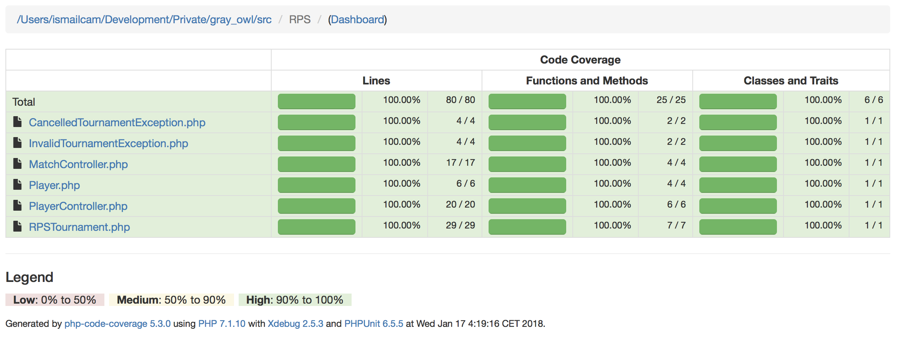
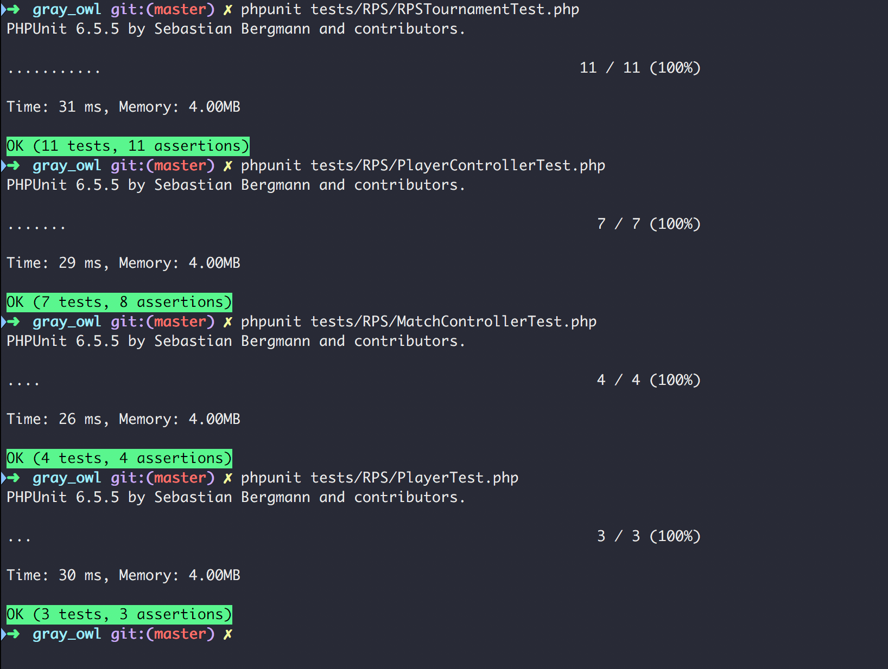

Scandesign media PHP gray owl tests
-----------------------------------

* Fork this repository
* Create all the code needed
* Reach 100% unit test coverage (yes it is possible)
* Ofcourse all unit tests needs to be green
* You are allowed to change composer.json if you want to use other packages
 
When finished

* Create a Pull request/Merge request

The tests are 

* [Rock, paper and scissor](src/RPS)
* [Product import](src/Import)

----

### Ismail Cam - Rock, paper and scissor

#### Implemented Classes
* [PlayerController.php](src/RPS/PlayerController.php)
* [MatchController.php](src/RPS/MatchController.php)

#### Modified Classes
* [RPSTournament.php](src/RPS/MatchController.php)
* [CancelledTournamentException.php](src/RPS/CancelledTournamentException.php)
* [InvalidTournamentException.php](src/RPS/InvalidTournamentException.php)
* [Player.php](src/RPS/Player.php)

#### Implemented Test Classes
* [RPSTournamentTest.php](tests/RPS/RPSTournamentTest.php)
* [PlayerControllerTest.php](tests/RPS/PlayerControllerTest.php)
* [MatchControllerTest.php](tests/RPS/MatchControllerTest.php)
* [PlayerTest.php](tests/RPS/PlayerTest.php)

#### Code Coverage Results

#### Test Results

